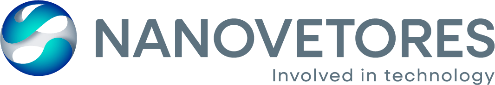

# Nanovetores Design System

> **Involved in technology**
> The brand foundation, tokens, assets and UI guidance for designing with the Nanovetores identity.

---

## About Nanovetores

Nanovetores is a Brazilian deep‑tech company specializing in **nanoencapsulation technology** — molecular‑scale carriers that deliver fragrances, active cosmetic ingredients, and functional compounds with controlled release. The company is owned by **Givaudan**, the Swiss flavour & fragrance house, and frequently co‑brands as `Givaudan | NANOVETORES`.

The brand sits at the intersection of **science, chemistry, and applied technology**. Its visual identity reflects that lineage: a polished spherical symbol (a nanoparticle in cross‑section), a precise geometric wordmark, and a palette anchored by a deep technology blue paired with a turquoise accent that evokes liquid, motion, and innovation.

### Audience and voice
Communications target **R&D buyers, formulators, and brand partners** — primarily B2B in cosmetics, personal care, home care, and textiles. Tone is **technical but accessible**, confident, and quietly aspirational. The tagline *Involved in technology* signals partnership rather than product‑pushing.

### Co‑branding with Givaudan
Whenever the two companies appear together — joint communications, sales material, regulatory documents — the lockup `Givaudan | NANOVETORES` (vertical bar separator) is used in place of the Nanovetores logo. Givaudan is the parent company; this is non‑negotiable in shared contexts.

---

## Sources & references

This design system was built from the official **Nanovetores Brand Manual**:

- **Brand manual (Wix Studio site):** https://gentil-vitor.wixstudio.com/manualnanovetore/blank
- **Logo files:** provided as PNGs (see `assets/logos/`).

> **No codebase, Figma file, or production UI was provided.** This system contains foundations + brand assets only — no UI kits or product‑surface recreations. If you have access to product UIs (the Nanovetores website, internal R&D tooling, or Givaudan portals), please attach them so we can build out `ui_kits/`.

---

## Index — what's in this folder

```
README.md                  ← you are here
SKILL.md                   ← agent skill front-matter (Claude Code compatible)
colors_and_type.css        ← all color, type, spacing, motion tokens
fonts/                     ← (empty) — see CONTENT FUNDAMENTALS for font note
assets/
  └─ logos/                ← all official Nanovetores + Givaudan|Nanovetores PNGs
preview/                   ← cards rendered in the Design System tab
```

> **No `ui_kits/` or `slides/` yet** — those require either a product surface to recreate or a deck template, neither of which was provided. Ask and I'll build them.

---

## CONTENT FUNDAMENTALS

### Voice & tone
- **Technical but human.** Nanovetores writes for chemists and product developers, not consumers — but never as a textbook. Sentences are short, declarative, and confident. Jargon is allowed when it adds precision; avoided when it just sounds smart.
- **Partnership framing.** The tagline *Involved in technology* sets the posture: Nanovetores is a collaborator, not a vendor. Copy reflects this — "we develop with you", "your formulation", "our technology, your brand".
- **Quietly proud.** Achievements (patents, awards, plant capacity) are stated as facts, not boasts. No exclamation marks. No superlatives ("the best", "world‑leading") unless verifiable.

### Person & address
- **First‑person plural ("we", "our")** for Nanovetores as a company.
- **Second person ("you", "your")** for the customer/partner.
- **Portuguese (BR) is the default** for domestic communications; **English** is used for international, scientific, and Givaudan contexts. The tagline itself is English: *Involved in technology*.

### Casing
- **Wordmark:** `NANOVETORES` is **always all‑caps** in the wordmark, never sentence‑cased.
- **Body copy:** sentence case. Use Title Case for proper nouns and product names only.
- **Tagline:** *Involved in technology* — sentence case, italic only when set inline; never all‑caps.
- **Co‑brand:** `Givaudan | NANOVETORES` — Givaudan is sentence case, Nanovetores is all‑caps, separated by a thin vertical bar with hair spaces.

### Numbers, units, scientific notation
- Use SI units. `nm`, `µm`, `mg/L`, `°C` — non‑breaking space between value and unit.
- Percentages: `30 %` style (BR convention) or `30%` (EN convention) — be consistent within a document.
- Concentrations and ratios spelled out the first time, abbreviated thereafter.

### Emoji
- **Never** in formal/external communications.
- **Avoid** in product UI.
- Acceptable in internal Slack/email only. No emoji in this design system.

### Specific examples
| Don't | Do |
| --- | --- |
| "Our amazing nano‑tech revolution!!" | "Nanoencapsulation, applied at industrial scale." |
| "Buy our products today 🔬" | "Talk to our R&D team about your formulation." |
| "We are the world's #1 leader in nano!" | "Over 40 active patents in controlled‑release delivery." |
| "Givaudan/Nanovetores" or "Givaudan & Nanovetores" | "Givaudan \| NANOVETORES" |

---

## VISUAL FOUNDATIONS

### Color
The palette is **two primary colors + two secondary grays**, plus working neutrals derived from those grays. There are **no warm colors** in the official brand — no reds, oranges, yellows beyond functional warning states.

| Role | Token | Hex | Use |
| --- | --- | --- | --- |
| Primary anchor | `--nv-blue` | `#002590` | Headlines, primary buttons, dark backgrounds, the wordmark when reversed |
| Primary accent | `--nv-turquoise` | `#00E4D0` | Highlights, accents, data visualisation, CTAs on dark surfaces |
| Secondary text | `--nv-gray-blue` | `#708597` | The default wordmark color; body text on light surfaces |
| Secondary surface | `--nv-gray-light` | `#E8EAED` | Cards, dividers, low‑contrast surfaces |

The blue is **deep and corporate** (not royal, not navy — Pantone Dark Blue C). The turquoise is **bright but cool**, leaning cyan. Together they read as "technology with motion".

### Typography
The wordmark is set in a **geometric, semi‑condensed, all‑caps sans** with even strokes and rounded but disciplined apertures. The closest free analogue is **Saira** (Google Fonts) — a Latin‑extended geometric sans that matches the proportions of the NANOVETORES wordmark very closely.

> **🚩 Font substitution flag.** The brand manual does **not** specify a font name. We are using **Saira** (display/wordmark) and **Inter** (body) as the closest publicly‑available match. If you have access to the actual brand font files (TTF/OTF/WOFF), drop them into `fonts/` and update `colors_and_type.css` — the rest of the system will follow.

The tagline *Involved in technology* is set in a **light humanist sans** at small size below or beside the wordmark. We approximate with **Inter Light**.

### Spacing & layout
- **4‑pt baseline grid.** All spacing tokens are multiples of 4px (`--sp-1` … `--sp-9`).
- **Generous whitespace.** Nanovetores layouts breathe. Cards have ≥24px padding; section gaps are 64–96px.
- **Logo protection area.** Reserve `1x` (where x = symbol width) on left/right and `0.5x` on top/bottom. Between symbol and wordmark, `0.5x`. Codified as `--logo-x` in tokens.
- **Minimum logo size:** 150px (digital) / 3cm (print). Below this, drop the tagline.

### Background treatments
- **Default:** clean white (`--bg-1`) or near‑white (`--bg-2`).
- **Dark hero:** the deep blue (`--nv-blue`), often with a subtle radial sheen toward turquoise that echoes the symbol's gradient.
- **Imagery:** scientific / industrial photography — laboratories, droplets, microscopy, manufacturing equipment. **Cool color cast preferred** (blue/teal whites, never warm tungsten). Slight desaturation is on‑brand.
- **No textures, patterns, or hand‑drawn illustrations.** The brand is clean‑surface. The only allowed "texture" is the chrome/teal sheen of the symbol itself, used sparingly.
- **Gradients** are reserved for hero moments and use the brand sweep (deep blue → turquoise). Never invent new gradient pairs.

### Animation
- **Restrained, technical.** Eases use `cubic-bezier(0.2, 0.7, 0.2, 1)` (ease‑out) for entrances and `cubic-bezier(0.4, 0, 0.2, 1)` for state changes.
- **Durations:** 120ms (micro), 200ms (default), 360ms (page/large reveals). No 500ms+ animations.
- **No bounces, no springs, no overshoot.** The brand is precise, not playful.
- **Fades > slides > scales.** Opacity transitions are the default. Used together: fade + small (~8px) translate.

### Hover & press states
- **Hover:** primary buttons darken ~8% in luminance (or shift to a slightly deeper blue). Secondary buttons gain a 1px border tint or a subtle `--bg-2` background. Links underline (1px).
- **Press:** 2% size shrink (`scale(0.98)`) **only** on primary CTAs; otherwise just deepen the color.
- **Focus:** 2px outline in `--nv-turquoise` with a 2px offset — high‑contrast for accessibility.

### Borders, shadows, elevation
- **Borders are 1px, low‑contrast** (`--nv-line` or `--nv-gray-light`). Heavy borders are off‑brand.
- **Shadows are soft and cool**, with a slight blue cast (`rgba(17, 33, 46, …)`). Three levels:
  - `--shadow-1` for inline cards
  - `--shadow-2` for elevated cards / dropdowns
  - `--shadow-3` for modals / floating panels
- A **branded shadow** `--shadow-blue` (deep blue, 18% alpha) accents primary CTAs and hero cards.
- **Inner shadows are not used.**

### Transparency & blur
- Used sparingly. Acceptable: 10% opacity logo watermarks on print; 50%/75% opacity on the symbol when behind/in front of motion graphics in video.
- **Backdrop blur** is allowed on overlays/menus over photography, but never as a decorative effect.

### Corner radii
- **Small (4–6px)** for buttons, inputs, badges.
- **Medium (10px)** for cards.
- **Large (16–24px)** for hero panels and feature cards.
- **Pill (full)** for chips, tags, status pills.
- **Never** square‑cornered controls. Never massive rounding (>24px) on UI elements.

### Cards
A canonical Nanovetores card:
- White background (`--bg-1`)
- 1px border `--nv-line` *or* `--shadow-1` (pick one, not both)
- 16–24px internal padding
- 10px radius (`--radius-md`)
- Optional 4px accent stripe on the top edge in `--nv-turquoise` for emphasized cards

### Layout rules
- **Logos are pinned top‑left** in product chrome, with the protection area respected.
- **Footers** carry the Givaudan|Nanovetores lockup, contact info, and a thin top border in `--nv-gray-light`.
- **Sticky elements** use `--shadow-2` to separate from scrolled content; never a hard border alone.

---

## ICONOGRAPHY

The Nanovetores brand manual **does not specify an icon system**. No icon font, no SVG library, no proprietary glyph set has been provided.

### Recommended approach
- **Use [Lucide](https://lucide.dev/) icons via CDN** as the default — its line weight (1.5px), rounded joins, and minimal style are the closest match to the brand's geometric, technical character.
  ```html
  <script src="https://unpkg.com/lucide@latest"></script>
  <i data-lucide="flask-conical"></i>
  ```
- **Stroke weight:** 1.5–2px. Match `--fg-2` (`#708597`) for default state, `--nv-blue` on hover/active.
- **Size:** 16, 20, 24, 32px on the 4‑pt grid.
- **No filled icons** unless specifically calling out a status (e.g. a filled checkmark for "verified").

### What NOT to do
- ❌ Don't use emoji as icons — they clash with the cool, technical palette.
- ❌ Don't mix icon sets (Lucide + Material + custom). Pick one and stick with it.
- ❌ Don't draw bespoke SVG illustrations from scratch in agent‑generated mockups — request real illustration assets instead.

> **🚩 Iconography flag.** This is a **substitution**. If Nanovetores has an internal icon set, please share it — we will swap Lucide out and update this section.

---

## Logo usage at a glance

The full rules are in the brand manual; key constraints:

- **Preferred lockup:** symbol + wordmark + tagline (`logo-completo.png`).
- **Size‑constrained:** drop the tagline (`logo-sem-tagline.png`).
- **Avatar / favicon / merch:** symbol only (`simbolo.png`).
- **Approved backgrounds:** white, `--nv-blue`, `--nv-turquoise`, `--nv-gray-blue`, photographic.
- **Co‑brand with Givaudan:** use `givaudan-nanovetores.png` (or `…-branco.png` on dark) — never construct the lockup yourself.
- **Minimum width:** 150px (digital) / 3cm (print). Below that, the tagline must be removed.
- **Watermark:** logo at 10% opacity (front) / 5% opacity (back) on print; 75% / 50% on video.

---

## Using this system

In any HTML artifact:

```html
<link rel="stylesheet" href="colors_and_type.css">

<header>
  
</header>

<h1>Encapsulation, engineered.</h1>
<p class="body-lg">Controlled‑release delivery systems for cosmetics, fragrance and home care.</p>
<button class="btn-primary">Talk to R&amp;D</button>
```

For agent skills + Claude Code compatibility, see `SKILL.md`.
